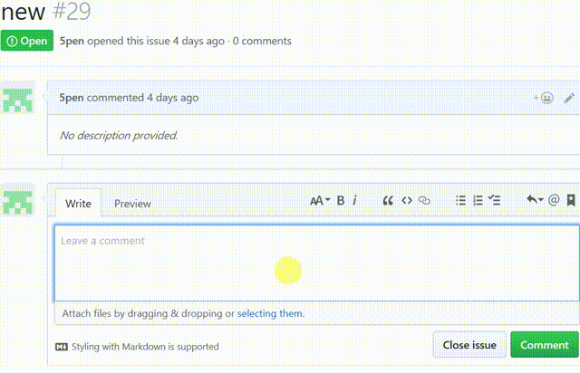

# Digest

> a GitHub App built with [probot](https://github.com/probot/probot)



## Usage
- Install the app on your GitHub Repositories:[github.com/apps/Simple digests robot](https://github.com/apps/simple-digests-robot)


- When opening a new issue or creating a new comment, you can use this phrase of "most popular issue" to get the url of the most popular issue in this profile.


- When opening a new issue or creating a new comment, you can use this phrase of "new release" to get the tag(s) of version(s) was/were published within 7 days in this profile.

## Setup

```
# Install dependencies
npm install

# Run the bot
npm start
```

See [docs/deploy.md](docs/deploy.md) if you would like to run your own instance of this app.
